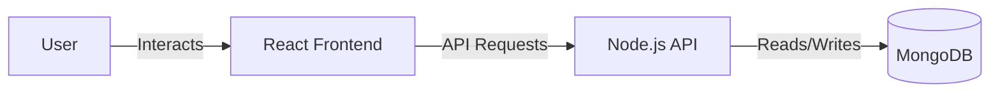

# SchemeGenie Architecture

## System Overview

SchemeGenie uses a modern, scalable MERN-style architecture (MongoDB, Express, React, Node.js) with integrated AI services.

### Core Data Flow diagram

User → React Frontend → Node.js API → MongoDB

### Backend Services encompass:
* **Scheme Recommendation Engine**: Suggests suitable government schemes based on user profiles.
* **OCR Document Processing**: Extracts and verifies content from uploaded documents.
* **Chatbot Service**: An AI-powered interactive assistant providing user guidance.
* **Application Tracking**: Manages and updates the status of submitted scheme applications.
* **Admin Dashboard**: Interfaces for administrative controls and application reviews.
